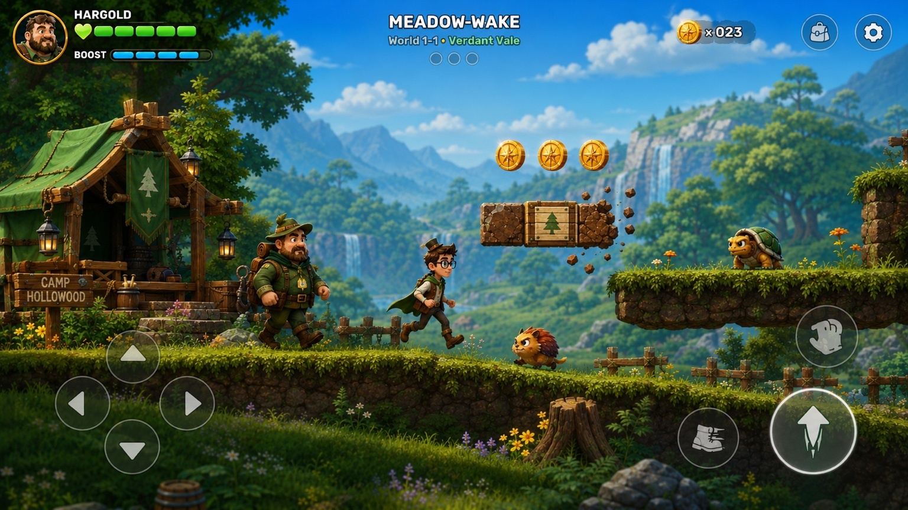
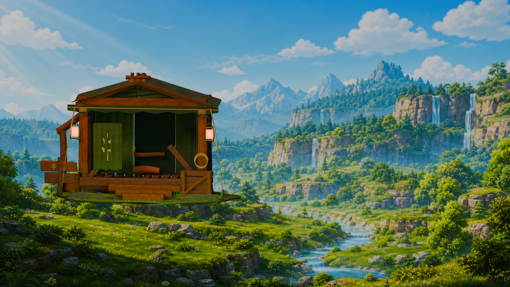

# Verdant Vale environment kit — camp quality gate

Status: **visual approval pending**. This is an isolated Blender hero-asset review, not a production integration or deployment.

## Required comparison

| Sole quality target | Current Blender camp gate |
| --- | --- |
|  |  |

The combined review sheet is [target-vs-camp-wide.png](target-vs-camp-wide.png). The supplemental close inspection is [camp-detail.png](camp-detail.png).

## What is actually authored

- Hand-hewn load-bearing frame, front/rear bents, ridge, rafters, braces, sill, plates, deck joists, plank deck, and three entrance steps.
- Layered green canvas roof and walls with modeled thickness, authored folds, scalloped valance, stitched seams, repair patch, tied-back opening, and original leaf-compass banner.
- Mortise-style pegs, iron/brass fasteners, exposed end grain, adze marks, rope lashings, roof stays, ground pegs, and lashed ridge crown.
- Two framed lanterns with chains and local warm light, a plank crate, barrel, bedroll, shelf, rope coil, and original unlettered wayfinding sign.
- A shallow camp-only grass footprint, restrained foundation stones, and contact vegetation. This is not the terrain-bank hero asset.

## Frozen boundaries

- The approved Verdant Vale background image is reused unchanged as a static camera-aligned layer. No mountains, cliffs, forests, waterfall, clouds, or sky were modeled or replaced.
- The canonical `opening-lodge` anchor remains `(-0.15, -0.485714, 0)` and gameplay layout/collision were not modified.
- Heroes, enemies, blocks, collectibles, camera behavior, movement, checkpoints, and course geometry were not touched.
- Tree family, terrain bank, rock/root formation, and all integration/export work remain explicitly blocked until the camp receives visual approval.

## Reproduction and validation

```powershell
& 'C:\Program Files\Blender Foundation\Blender 5.2\blender.exe' --background --python tools\blender\environment\build_verdant_vale_camp_quality_gate.py
& 'C:\Program Files\Blender Foundation\Blender 5.2\blender.exe' --background assets\blender\environments\world-1\verdant-vale-camp-quality-gate.blend --python tools\blender\environment\validate_verdant_vale_camp_quality_gate.py
```

The structural validator passes. Visual approval remains a human art-direction decision and is intentionally not inferred from structural checks.
